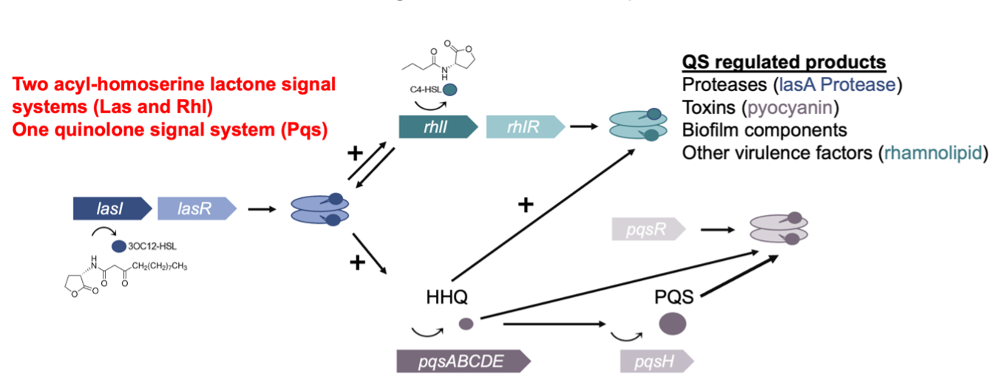

# Quorum-Sensing_Project

## Description
This project aims to disentangle the spatial patterns of Quorum Sensing System in *Pseudomonas aeruginosa* by using high resolution fluorescent microscopy with microcolonies grow on agarose patches.

## Quorum Sensing System in *Pseudomonas aeruginosa*
*P. aeruginosa* is a Gram-negative, opportunistic human pathogen with a highly intricate QS regulatory network as shown in . It employs three QS systems: las, rhl, and pqs. The las and rhl systems both use acyl-homoserine lactones as the backbone for their autoinducers and operate through a cascade involving three key genes: the signal synthase gene, receptor gene, and product genes. The pqs system, in contrast, utilizes quinolones as autoinducers and features a more complex gene cascade. Together, these systems regulate the expression of hundreds of genes in response to increasing cell density, orchestrating processes ranging from virulence factor production to biofilm formation.

## Analysis
The single-cell segmentation and tracking was done by [Delta2](https://gitlab.com/delta-microscopy/delta) based on the phase contrast channel of the microscopic images. The Housekeeping gene *rpsL* and Quorum Sensing gene expressions are investigated through the mCherry and GFP channel fluorescent intensity.
